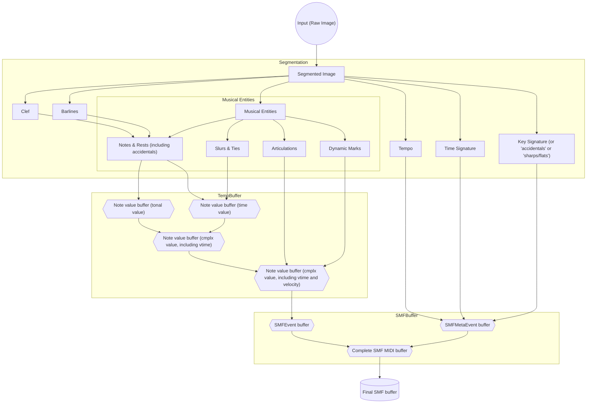

# playback

## <u>_Looking for a good repository/software name_</u>

> Warning: `playback` is still in development and breaking changes are to be expected.

> ## Note:

> Python **_Will Not Be Accepted_** in this codebase.

playback is an open-sourced project that takes images of sheet music and converts them to MIDI files (to then either be played back, put into a DAW, or put into music notation software).

There is not much documentation currently, as the project is still in the early development stages.

Below is a graphical representation of the dataflow for the core (raw image to MIDI) pipeline:

Some limitations of this model should be noted:

-   time signature changes are not supported
-   tempo changes are not supported
-   key signature changes may be difficult to implement
-   swing is not supported

A possible workaround for some of these difficulties is to use more image processing to separate the input into several inputs, then process them separately as if they were independent inputs. (utilizing specialized subprocesses)

