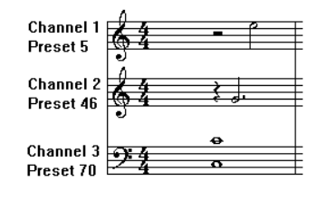

# Standard MIDI Files 1.0

---

> Published by: The MIDI Manufacturers Association Los Angeles, CA
> RP001 Revised February 1996 Copyright © 1988, 1994, 1996 MIDI Manufacturers Association ALL RIGHTS RESERVED.NO PART OF THIS DOCUMENT MAY BE REPRODUCED IN ANY FORM OR BY ANY MEANS,ELECTRONIC OR MECHANICAL, INCLUDING INFORMATION STORAGE AND RETRIEVAL SYSTEMS, WITHOUT PERMISSION IN WRITING FROM THE MIDIMANUFACTURERS ASSOCIATION. MMA POB 3173 La Habra CA 90632-3173

## Introduction

The document outlines the specification for MIDI Files. The purpose of MIDI Files is to provide a way of interchanging time-stamped MIDI data between different programs on the same or different computers. One of the primary design goals is compact representation, which makes it very appropriate for a disk-based file format, but which might make it inappropriate for storing in memory for quick access by a sequencer program. (It can be easily converted to a quickly-accessible format on the fly as files are read in or written out.) It is not intended to replace the normal file format of any program, though it could be used for this purpose if desired.

MIDI Files contain one or more MIDI streams, with time information for each event. Song, sequence, and track structures, tempo and time signature information, are all supported. Track names and other descriptive information may be stored with the MIDI data. This format supports multiple tracks and multiple sequences so that if the user of a program which supports multiple tracks intends to move a file to another one, this format can allow that to happen.

This spec defines the 8-bit binary data stream used in the file. The data can be stored in a binary file, nibbleized, 7-bit-ized for efficient MIDI transmission, converted to Hex ASCII, or translated symbolically to a printable text file. This spec addresses what's in the 8-bit stream. It does not address how a MIDI File will be transmitted over MIDI. It is the general feeling that a MIDI transmission protocol will be developed for files in general and MIDI Files will used this scheme.

## Sequences, Tracks, Chunks: File Block Structure

### Conventions

In this document, bit 0 means the least significant bit of a byte, and bit 7 is the most significant.

Some numbers in MIDI Files are represented in a form called a _variable-length quantity_. These numbers are represented 7 bits per byte, most significant bits first. All bytes except the last have bit 7 set, and the last byte has bit 7 clear. If the number is between 0 and 127, it is thus represented exactly as one byte.

Here are some examples of numbers represented as variable-length quantities:

| Number (hex) | Representation (hex) |
| :----------: | :------------------: |
|  `00000000`  |         `00`         |
|  `00000040`  |         `40`         |
|  `0000007F`  |         `7F`         |
|  `00000080`  |       `81 00`        |
|  `00002000`  |       `C0 00`        |
|  `00003FFF`  |       `FF 7F`        |
|  `00004000`  |      `81 80 00`      |
|  `00100000`  |      `C0 80 00`      |
|  `001FFFFF`  |      `FF FF 7F`      |
|  `00200000`  |    `81 80 80 00`     |
|  `08000000`  |    `C0 80 80 00`     |
|  `0FFFFFFF`  |    `FF FF FF 7F`     |

The largest number which is allowed is `0FFFFFFF` so that the variable-length representation must fit in 32 bits in a routine to write variable-length numbers. Theoretically, larger numbers are possible, but 2 x 10^8 96ths of a beat at a fast tempo of 500 beats per minute is four days, long enough for any delta-time!

### Files

To any file system, a MIDI File is simply a series of 8-bit bytes. On the Macintosh, this byte stream is stored in the data fork of a file (with file type 'Midi'), or on the Clipboard (with data type 'Midi'). Most other computers store 8-bit byte streams in files — naming or storage conventions for those computers will be defined as required.

### Chunks

MIDI Files are made up of _chunks_. Each chunk has a 4-character type and a 32-bit length, which is the number of bytes in the chunk. This structure allows future chunk types to be designed which may easily be ignored if encountered by a program written before the chunk type is introduced. Your programs should expect alien chunks and treat them as if they weren't there.

Each chunk begins with a 4-character ASCII type. It is followed by a 32-bit length, most significant byte first (a length of 6 is stored as `00 00 00 06`). This length refers to the number of bytes of data which follow: the eight bytes of type and length are not included. Therefore, a chunk with a length of 6 would actually occupy 14 bytes in the disk file.

This chunk architecture is similar to that used by Electronic Arts' IFF format, and the chunks described herein could easily be placed in an IFF file. The MIDI File itself is not an IFF file: it contains no nested chunks, and chunks are not constrained to be an even number of bytes long. Converting it to an IFF file is as easy as padding odd-length chunks, and sticking the whole thing inside a FORM chunk.

MIDI Files contain two types of chunks: header chunks and track chunks. A _header_ chunk provides a minimal amount of information pertaining to the entire MIDI file. A _track_ chunk contains a sequential stream of MIDI data which may contain information for up to 16 MIDI channels. The concepts of multiple tracks, multiple MIDI outputs, patterns, sequences, and songs may all be implemented using several track chunks.

A MIDI file always starts with a header chunk, and is followed by one or more track chunks.

```xml
MThd <length of header data>

<header data>
MTrk <length of track data>
<track data>
MTrk <length of track data>
<track data>
...
```

## Chunk Descriptions

### Header Chunks

The header chunk at the beginning of the file specifies some basic information about the data in the file. Here's the syntax of the complete chunk:

```xml
<Header Chunk> = <chunk type> <length> <format> <ntrks> <division>
```

As described above, `<chunk type>` is the four ASCII characters 'MThd'; `<length>` is a 32-bit representation of the number 6 (high byte first).

The data section contains three 16-bit words, stored most-significant byte first.

The first word, `<format>`, specifies the overall organization of the file. Only three values of `<format>` are specified:

-   0 the file contains a single multi-channel track
-   1 the file contains one or more simultaneous tracks (or MIDI outputs) of a sequence
-   2 the file contains one or more sequentially independent single-track patterns

More information about these formats is provided below.

The next word, `<ntrks>`, is the number of track chunks in the file. It will always be 1 for a format 0 file.

The third word, `<division>`, specifies the meaning of the delta-times. It has two formats, one for metrical time, and one for time-code-based time:

#### TODO

0 ticks per quarter-note 1 15 14 8 7 0 ticks per frame negative SMPTE format

If bit 15 of `<division>` is a zero, the bits 14 thru 0 represent the number of delta-time "ticks" which make up a quarter-note. For instance, if `<division>` is 96, then a time interval of an eighth-note between two events in the file would be 48.

If bit 15 of `<division>` is a one, delta-times in a file correspond to subdivisions of a second, in a way consistent with SMPTE and MIDI time code. Bits 14 thru 8 contain one of the four values -24, -25, -29, or -30, corresponding to the four standard SMPTE and MIDI time code formats (-29 corresponds to 30 drop frame), and represents the number of frames per second. These negative numbers are stored in two's complement form. The second byte (stored positive) is the resolution within a frame: typical values may be 4 (MIDI time code resolution), 8, 10, 80 (bit resolution), or 100. This system allows exact specification of time-code-based tracks, but also allows millisecond-based tracks by specifying 25 frames/sec and a resolution of 40 units per frame. If the events in a file are stored with bit resolution of thirty-frame time code, the division word would be E250 hex.

### Formats 0, 1, and 2

A Format 0 file has a header chunk followed by one track chunk. It is the most interchangeable representation of data. It is very useful for a simple single-track player in a program which needs to make synthesizers make sounds, but which is primarily concerned with something else such as mixers or sound effect boxes. It is very desirable to be able to produce such a format, even if your program is track-based, in order to work with these simple programs. On the other hand, perhaps someone will write a format conversion from format 1 to format 0 which might be so easy to use in some setting that it would save you the trouble of putting it into your program.

A Format 1 or 2 file has a header chunk followed by one or more track chunks. Programs which support several simultaneous tracks should be able to save and read data in format 1, a vertically one-dimensional form, that is, as a collection of tracks. Programs which support several independent patterns should be able to save and read data in format 2, a horizontally one-dimensional form. Providing these minimum capabilities will ensure maximum interchangeability.

In a MIDI system with a computer and a SMPTE synchronizer which uses Song Pointer and Timing Clock, tempo maps (which describe the tempo throughout the track, and may also include time signature information, so that the bar number may be derived) are generally created on the computer. To use them with the synchronizer, it is necessary to transfer them from the computer. To make it easy for the synchronizer to extract this data from a MIDI File, tempo information should always be stored in the first MTrk chunk. For a format 0 file, the tempo will be scattered through the track and the tempo map reader should ignore the intervening events; for a format 1 file, the tempo map must be stored as the first track. It is polite to a tempo map reader to offer your user the ability to make a format 0 file with just the tempo, unless you can use format 1.

All MIDI Files should specify tempo and time signature. If they don't, the time signature is assumed to be 4/4, and the tempo 120 beats per minute. In format 0, these meta-events should occur at least at the beginning of the single multi-channel track. In format 1, these meta-events should be contained in the first track. In format 2, each of the temporally independent patterns should contain at least initial time signature and tempo information.

We may decide to define other format IDs to support other structures. A program encountering an unknown format ID may still read other MTrk chunks it finds from the file, as format 1 or 2, if its user can make sense of them and arrange them into some other structure if appropriate. Also, more parameters may be added to the MThd chunk in the future: it is important to read and honor the length, even if it is longer than 6.

### Track Chunks

The track chunks (type MTrk) are where actual song data is stored. Each track chunk is simply a stream of MIDI events (and non-MIDI events), preceded by delta-time values. The format for Track Chunks (described below) is exactly the same for all three formats (0, 1, and 2: see "Header Chunk" above) of MIDI Files.

Here is the syntax of an MTrk chunk (the + means "one or more": at least one MTrk event must be present):

```xml
 <Track Chunk> = <chunk type> <length> <MTrk event>+
```

The syntax of an MTrk event is very simple:

```xml
<MTrk event> = <delta-time> <event>
```

`<delta-time>` is stored as a variable-length quantity. It represents the amount of time before the following event. If the first event in a track occurs at the very beginning of a track, or if two events occur simultaneously, a delta-time of zero is used. Delta-times are always present. (Not storing delta-times of 0 requires at least two bytes for any other value, and most delta-times aren't zero.) Delta-time is in ticks as specified in the header chunk.

```xml
<event> = <MIDI event> | <sysex event> | <meta-event>
```

`<MIDI event>` is any MIDI channel message. Running status is used: status bytes of MIDI channel messages may be omitted if the preceding event is a MIDI channel message with the same status. The first event in each MTrk chunk must specify status. Delta-time is notconsidered an event itself: it is an integral part of the syntax for an MTrk event. Notice that running status occurs _across_ delta-times.

`<sysex event>` is used to specify a MIDI system exclusive message, either as one unit or in packets, or as an "escape" to specify any arbitrary bytes to be transmitted. A normal complete system exclusive message is stored in a MIDI File in this way:

```xml
F0 <length> <bytes to be transmitted after F0>
```

The length is stored as a variable-length quantity. It specifies the number of bytes which follow it, not including the F0 or the length itself. For instance, the transmitted message F0 43 12 00 07 F7 would be stored in a MIDI file as F0 05 43 12 00 07 F7. It is required to include the F7 at the end so that the reader of the MIDI file knows that it has read the entire message.

Another form of sysex event is provided which does not imply that an F0 should be transmitted. This may be used as an "escape" to provide for the transmission of things which would not otherwise be legal, including system realtime messages, song pointer or select, MIDI Time Code, etc. This uses the F7 code:

```xml
F7 <length> <all bytes to be transmitted>
```

Unfortunately, some synthesizer manufacturers specify that their system exclusive messages are to be transmitted as little packets. Each packet is only part of an entire syntactical system exclusive message, but the times they are transmitted at are important. Examples of this are the bytes sent in a CZ patch dump, or the FB-01's "system exclusive mode" in which microtonal data can be transmitted. The F0 and F7 sysex events may be used together to break up syntactically complete system exclusive messages into timed packets.

An F0 sysex event is used for the first packet an a series — it is a message in which the F0 should be transmitted. An F7 sysex event is used for the remainder of the packets, which do not begin with F0. (Of course, the F7 is not considered part of the system exclusive message).

A syntactic system exclusive message must always end with an F7, even if the real-life device didn't send one, so that you know when you've reached the end of an entire sysex message without looking ahead to the next event in the MIDI file. If it's stored in one complete F0 sysex event, the last byte must be an F7. If it is broken up into packets, the last byte of the last packet must be an F7. There also must not be any transmittable MIDI events in between the packets of a multi-packet system exclusive message. This principle is illustrated in the paragraph below.

Here is an example of a multi-packet system exclusive message: suppose the bytes `F0 43 12 00` were to be sent, followed by a 200-tick delay, followed by the bytes `43 12 00 43 12 00`, followed by a 100-tick delay, followed by the bytes `43 12 00 F7`, this would be in the MIDI File:

|                           |                     |
| :------------------------ | :------------------ |
| `F0 03 43 12 00`          |                     |
| `81 48`                   | 200-tick delta-time |
| `F7 06 43 12 00 43 12 00` |                     |
| `64`                      | 100-tick delta-time |
| `F7 04 43 12 00 F7`       |                     |

When reading a MIDI File, and an F7 sysex event is encountered without a preceding F0 sysex event to start a multi-packet system exclusive message sequence, it should be presumed that the F7 event is being used as an "escape". In this case, it is not necessary that it end with an F7, unless it is desired that the F7 be transmitted.

`<meta-event>` specifies non-MIDI information useful to this format or to sequencers, with this syntax:

```xml
FF <type> <length> <bytes>
```

All meta-events begin with FF, then have an event type byte (which is always less than 128), and then have the length of the data stored as a variable-length quantity, and then the data itself. If there is no data, the length is 0. As with chunks, future meta-events may be designed which may not be known to existing programs, so programs must properly ignore meta-events which they do not recognize, and indeed, should expect to see them. Programs must never ignore the length of a meta-event which they do recognize, and they shouldn't be surprised if it's bigger than they expected. If so, they must ignore everything past what they know about. However, they must not add anything of their own to the end of a meta-event.

Sysex events and meta-events cancel any running status which was in effect. Running status does not apply to and may not be used for these messages.

## Meta-Events

A few meta-events are defined herein. It is not required for every program to support every meta-event.

In the syntax descriptions for each of the meta-events a set of conventions is used to describe parameters of the events. The FFwhich begins each event, the type of each event, and the lengths of events which do not have a variable amount of data are given directly in hexadecimal. A notation such as ddor se, which consists of two lower-case letters, mnemonically represents an 8-bit value. Four identical lower-case letters such as wwww refer to a 16-bit value, stored most-significant-byte first. Six identical lower-case letters such as ttttttrefer to a 24-bit value, stored most-significant-byte first. The notation len refers to the length portion of the meta-event syntax, that is, a number, stored as a variable-length quantity, which specifies how many data bytes follow it in the meta-event. The notations textand datarefer to however many bytes of (possibly text) data were just specified by the length.

In general, meta-events in a track which occur at the same time may occur in any order. If a copyright event is used, it should be placed as early as possible in the file, so it will be noticed easily. Sequence Number and Sequence/Track Name events, if present, must appear at time 0. An end-of-track event must occur as the last event in the track.

Meta-events initially defined include:

### Sequence Number

```xml
FF 00 02 ssss
```

This optional event, which must occur at the beginning of a track, before any nonzero delta-times, and before any transmittable MIDI events, specifies the number of a sequence. In a format 2 MIDI file, it is used to identify each "pattern" so that a "song" sequence using the Cue message to refer to the patterns. If the ID numbers are omitted, the sequences' locations in order in the file are used as defaults. In a format 0 or 1 MIDI file, which only contain one sequence, this number should be contained in the first (or only) track. If transfer of several multitrack sequences is required, this must be done as a group of format 1 files, each with a different sequence number.

### Text Event

```xml
FF 01 len text
```

Any amount of text describing anything. It is a good idea to put a text event right at the beginning of a track, with the name of the track, a description of its intended orchestration, and any other information which the user wants to put there. Text events may also occur at other times in a track, to be used as lyrics, or descriptions of cue points. The text in this event should be printable ASCII characters for maximum interchange. However, other character codes using the high-order bit may be used for interchange of files between different programs on the same computer which supports an extended character set. Programs on a computer which does not support non-ASCII characters should ignore those characters. Meta event types 01 through 0F are reserved for various types of text events, each of which meets the specification of text events(above) but is used for a different purpose.

### Copyright Notice

```xml
FF 02 len text
```

Contains a copyright notice as printable ASCII text. The notice should contain the characters (C), the year of the copyright, and the owner of the copyright. If several pieces of music are in the same MIDI file, all of the copyright notices should be placed together in this event so that it will be at the beginning of the file. This event should be the first event in the first track chunk, at time 0.

### Sequence/Track Name

```xml
FF 03 len text
```

If in a format 0 track, or the first track in a format 1 file, the name of the sequence. Otherwise, the name of the track.

### Instrument Name

```xml
FF 04 len text
```

A description of the type of instrumentation to be used in that track. May be used with the MIDI Prefix meta-event to specify which MIDI channel the description applies to, or the channel may be specified as text in the event itself.

### Lyric

```xml
FF 05 len text
```

A lyric to be sung. Generally, each syllable will be a separate lyric event which begins at the event's time.

### Marker

```xml
FF 06 len text
```

Normally in a format 0 track, or the first track in a format 1 file. The name of that point in the sequence, such as a rehearsal letter or section name ("First Verse", etc.).

### Cue Point

```xml
FF 07 len text
```

A description of something happening on a film or video screen or stage at that point in the musical score ("Car crashes into house", "curtain opens", "she slaps his face", etc.)

### MIDI Channel Prefix

```xml
FF 20 01 cc
```

The MIDI channel (0-15) contained in this event may be used to associate a MIDI channel with all events which follow, including System Exclusive and meta-events. This channel is "effective" until the next normal MIDI event (which contains a channel) or the next MIDI Channel Prefix meta-event. If MIDI channels refer to "tracks", this message may help jam several tracks into a format 0 file, keeping their non-MIDI data associated with a track. This capability is also present in Yamaha's ESEQ file format.

### End of Track

```xml
FF 2F 00
```

This event is not optional. It is included so that an exact ending point may be specified for the track, so that it has an exact length, which is necessary for tracks which are looped or concatenated.

### Set Tempo

```xml
FF 51 03 tttttt
```

Set tempo, in microseconds per MIDI quarter-note This event indicates a tempo change. Another way of putting "microseconds per quarter-note" is "24ths of a microsecond per MIDI clock". Representing tempos as time per beat instead of beat per time allows absolutely exact long-term synchronization with a time-based sync protocol such as SMPTE time code or MIDI time code. This amount of accuracy provided by this tempo resolution allows a four-minute piece at 120 beats per minute to be accurate within 500 usec at the end of the piece. Ideally, these events should only occur where MIDI clocks would be located — this convention is intended to guarantee, or at least increase the likelihood, of compatibility with other synchronization devices so that a time signature/tempo map stored in this format may easily be transferred to another device.

### SMPTE Offset

```xml
FF 54 05 hr mn se fr ff
```

This event, if present, designates the SMPTE time at which the track chunk is supposed to start. It should be present at the beginning of the track, that is, before any nonzero delta-times, and before any transmittable MIDI events. The hour must be encoded with the SMPTE format, just as it is in MIDI Time Code. In a format 1 file, the SMPTE Offset must be stored with the tempo map, and has no meaning in any of the other tracks. The ff field contains fractional frames, in 100ths of a frame, even in SMPTE-based tracks which specify a different frame subdivision for delta-times.

### Time Signature

```xml
FF 58 04 nn dd cc bb
```

The time signature is expressed as four numbers. nn and dd represent the numerator and denominator of the time signature as it would be notated. The denominator is a negative power of two: 2 represents a quarter-note, 3 represents an eighth-note, etc. The cc parameter expresses the number of MIDI clocks in a metronome click. The bbparameter expresses the number of notated 32nd-notes in what MIDI thinks of as a quarter-note (24 MIDI Clocks). This was added because there are already multiple programs which allow the user to specify that what MIDI thinks of as a quarter-note (24 clocks) is to be notated as, or related to in terms of, something else.

Therefore, the complete event for 6/8 time, where the metronome clicks every three eighth-notes, but there are 24 clocks per quarter-note, 72 to the bar, would be (in hex):

```xml
FF 58 04 06 03 24 08
```

That is, 6/8 time (8 is 2 to the 3rd power, so this is 06 03), 36 MIDI clocks per dotted-quarter (24 hex!), and eight notated 32nd-notes per MIDI quarter note.

### Key Signature

```xml
FF 59 02 sf mi
```

|         |                    |
| :------ | :----------------- |
| sf = -7 | 7 flats            |
| sf = -1 | 1 flat             |
| sf = 0  | no sharps or flats |
| sf = 1  | 1 sharp            |
| sf = 7  | 7 sharps           |
| mi = 0  | major key          |
| mi = 1  | minor key          |

### Sequencer-Specific Meta-Event

```xml
FF 7F len data
```

Special requirements for particular sequencers may use this event type: the first byte or bytes of data is a manufacturer ID (these are one byte, or, if the first byte is 00, three bytes). As with MIDI System Exclusive, manufacturers who define something using this meta-event should publish it so that others may know how to use it. After all, this is an interchange format. This type of event may be used by a sequencer which elects to use this as its only file format; sequencers with their established feature-specific formats should probably stick to the standard features when using _this_ format.

## Program Fragments and Example MIDI Files

Here are some of the routines to read and write variable-length numbers in MIDI Files. These routines are in C, and use getc and putc, which read and write single 8-bit characters from/to the files infile and outfile.

```c
#define TRUE 1

#define OUTFILE "example_1.mid"
#define INFILE "example_2.mid"

write_var_len(value) {
 register long long value;
 register long buffer;
 buffer = value & 0x7f;
 while ((value >>= 7) > 0) {
  buffer <<= 8;
  buffer |= 0x80;
  buffer += (value & 0x7f);
 }
 while (TRUE) {
  putc(buffer, OUTFILE);
  if (buffer & 0x80)
   buffer >>= 8;
  else
   break;
 }
}
unsigned long long read_var_len() {
 register unsigned long long value;
 register unsigned char c;
 if ((value = getc(INFILE)) & 0x80) {
  value &= 0x7f;
  do {
   value = (value << 7) + ((c = getc(INFILE)) & 0x7f);
  } while (c & 0x80);
 }
 return (value);
}

```

As an example, MIDI Files for the following excerpt are shown below. First, a format 0 file is shown, with all information intermingled; then, a format 1 file is shown with all data separated into four tracks: one for tempo and time signature, and three for the notes. A resolution of 96 "ticks" per quarter note is used. A time signature of 4/4 and a tempo of 120, though implied, are explicitly stated.



The contents of the MIDI stream represented by this example are broken down here:

| Delta Time (dec) | Event Code (hex) | Other Bytes (dec) | Comment                                                              |
| ---------------: | :--------------- | :---------------- | :------------------------------------------------------------------- |
|              `0` | `FF 58`          | `04 04 02 24 08`  | 4 bytes: 4/4 time, 24 MIDI clocks/click, 8 32nd notes/24 MIDI clocks |
|              `0` | `FF 51`          | `03 500000`       | 3 bytes: 500,000 μsec per quarter-note                               |
|              `0` | `C0`             | `5`               | Ch. 1, Program Change 5                                              |
|              `0` | `C1`             | `46`              | Ch. 2, Program Change 46                                             |
|              `0` | `C2`             | `70`              | Ch. 3, Program Change 70                                             |
|              `0` | `92`             | `48 96`           | Ch. 3 Note On #48, forte                                             |
|              `0` | `92`             | `60 96`           | Ch. 3 Note On #60, forte 96                                          |
|             `91` | `67`             | `64`              | Ch. 2 Note On #67, mezzo-forte 96                                    |
|             `90` | `76`             | `32`              | Ch. 1 Note On #76, piano                                             |
|            `192` | `82`             | `48 64`           | Ch. 3 Note Off #48, standard                                         |
|              `0` | `82`             | `60 64`           | Ch. 3 Note Off #60, standard                                         |
|              `0` | `81`             | `67 64`           | Ch. 2 Note Off #67, standard                                         |
|              `0` | `80`             | `76 64`           | Ch. 1 Note Off #76, standard                                         |
|              `0` | `FF 2F`          | `00`              | Track End                                                            |

The entire format 0 MIDI file contents in hex follows.

First, the header chunk:

|               |                  |
| :-----------: | :--------------: |
| `4D 54 68 64` |       MThd       |
| `00 00 00 06` |   chunk length   |
|    `00 00`    |      format      |
|   `0 00 01`   |    one track     |
|  `00 60 96`   | per quarter-note |

Then, the track chunk. Its header, followed by the events (notice that running status is used in places):

|               |                   |
| :-----------: | :---------------: |
| `4D 54 72 6B` |       MTrk        |
| `00 00 00 3B` | chunk length (59) |

| Delta-time | Event                  | Comments            |
| ---------: | :--------------------- | :------------------ |
|       `00` | `FF 58 04 04 02 18 08` | time signature      |
|       `00` | `FF 51 03 07 A1 20`    | tempo               |
|       `00` | `C0 05`                |                     |
|       `00` | `C1 2E`                |                     |
|       `00` | `C2 46`                |                     |
|       `00` | `92 30 60`             |                     |
|       `00` | `3C 60`                | running status      |
|       `60` | `91 43 40`             |                     |
|       `60` | `90 4C 20`             |                     |
|    `81 40` | `82 30 40`             | two-byte delta-time |
|       `00` | `3C 40`                | running status      |
|       `00` | `81 43 40`             |                     |
|       `00` | `80 4C 40`             |                     |
|       `00` | `FF 2F 00`             | end of track        |

A format 1 representation of the file is slightly different. First, its header chunk:

|               |                  |
| :-----------: | :--------------: |
| `4D 54 68 64` |       MThd       |
| `00 00 00 06` |   chunk length   |
|    `00 01`    |     format 1     |
|    `00 04`    |   four tracks    |
|  `00 60 96`   | per quarter-note |

Then the track chunk for the time signature/tempo track. Its header, followed by the events:

|               |                   |
| :-----------: | :---------------: |
| `4D 54 72 6B` |       MTrk        |
| `00 00 00 14` | chunk length (20) |

| Delta-time | Event                  | Comments       |
| ---------: | :--------------------- | :------------- |
|       `00` | `FF 58 04 04 02 18 08` | time signature |
|       `00` | `FF 51 03 07 A1 20`    | tempo          |
|    `83 00` | `FF 2F 00`             | end of track   |

Then, the track chunk for the first music track. The MIDI convention for note on/off running status is used in this example:

|               |                   |
| :-----------: | :---------------: |
| `4D 54 72 6B` |       MTrk        |
| `00 00 00 10` | chunk length (16) |

| Delta-time | Event      | Comments                         |
| ---------: | :--------- | :------------------------------- |
|       `00` | `C0 05`    |                                  |
|    `81 40` | `90 4C 20` |                                  |
|    `81 40` | `4C 00`    | Running status: note on, vel = 0 |
|       `00` | `FF 2F 00` | end of track                     |

Then, the track chunk for the second music track:

|               |                   |
| :-----------: | :---------------: |
| `4D 54 72 6B` |       MTrk        |
| `00 00 00 0F` | chunk length (15) |

| Delta-time | Event      | Comments       |
| ---------: | :--------- | :------------- |
|       `00` | `C1 2E`    |                |
|       `60` | `91 43 40` |                |
|    `82 20` | `43 00`    | running status |
|       `00` | `FF 2F 00` | end of track   |

Then, the track chunk for the third music track:

|               |                   |
| :-----------: | :---------------: |
| `4D 54 72 6B` |       MTrk        |
| `00 00 00 15` | chunk length (21) |

| Delta-time | Event      | Comments                            |
| ---------: | :--------- | :---------------------------------- |
|       `00` | `C2 46`    |                                     |
|       `00` | `92 30 60` |                                     |
|       `00` | `3C 60`    | running status                      |
|    `83 00` | `30 00`    | two-byte delta-time, running status |
|       `00` | `3C 00`    | running status                      |
|       `00` | `FF 2F 00` | end of track                        |

Calculating Delta Times:

Now here's an example of how cumulative delta time gets converted into milliseconds. In the simplest case, there are 2 pieces of information needed:

1. The SMF Header Chunk defines a "division" which is delta ticks per quarter note. (eg., 96 = 96 ppq) (Ref: pg. 4, SMF 1.0)

2. The Tempo setting, which is a non-MIDI data Meta Event typically found at time delta time 0 in the first track of an SMF. If it isn't specified, tempo is assumed to be 120 bpm. Tempo is expressed as microseconds per quarter note. (eg., 500000 = 120 bpm). (Ref: pgs. 5,9, SMF 1.0)

To convert delta-time ticks into milliseconds, you simply do a straightforward algebraic calculation:

Time (in ms.) = (Number of Ticks) \* (Tempo (uS/qn) / Div (ticks/qn)) / 1000

As an example, if the Set Tempo value were 500000 uS per qn, and the Division were 96 ticks per qn, then the amount of time at 6144 Ticks into the SMF would be:

Time = 6144 \* (500000/96) / 1000 = 32000

milliseconds The above example is a very simple case. In practice, SMFs can contain multiple Set Tempo Meta Events spaced throughout the file, and in order to calculate a correct elapsed time for any Tick, a running calculation needs to be performed.

Note that while the Time Signature is not needed to perform the above calculation, Time Signature is needed, however, if the elapsed time is desired for a particular Bar/Beat value. As with Set Tempo changes, the Time Signature can change throughout an SMF, and a running calculation is usually necessary to determine a correct elapsed time for any Bar/Beat

---

> MIDI Org SMF 1.0 Specification
> Transcribed by Mark Gutenberger, 2022, (C) all rights reserved
> Licensed under the [UNLICENSE](./LICENSE-UNLICENSE.md) for free use and distribution
